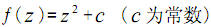

# Fractals Everywhere

大四的时候，因为接触python模块matplotlib，才知道“分形”的，当时觉得这太酷了，当晚就从亚马逊买了本书《Fractals Everywhere》，即《无处不在的分形》。因为工作缘故，毕业后就放在家里了，这次春节后就顺便带过来了，准备好好学习下。

# 分形

美籍数学家曼德布罗特(B.B.Mandelbrot)把`部分`与`整体`以某种方式相似的形体称为分形(fractal)。
分形（Fractal）一词，其原意是不规则、支离破碎的意思，认为一切复杂对象虽然看似杂乱无章,但他们具有相似性，简单地说，就是把复杂对象的某个局部进行放大，其形态和复杂程度与整体相似。
1975年,他创立了分形几何学(fractalgeometry)。在此基础上,形成了研究分形性质及其应用的科学,称为分形理论(fractaltheory).

# 自相似原则

线性分形又称为自相似分形。`自相似原则`和`迭代生成原则`是分形理论的重要原则。它表征分形在通常的几何变换下具有不变性,即标度无关性。由自相似性是从不同尺度的对称出发,也就意味着递归。分形形体中的自相似性可以是完全相同,也可以是统计意义上的相似。标准的自相似分形是数学上的抽象,迭代生成无限精细的结构,如科赫(Koch)雪花曲线、谢尔宾斯基(Sierpinski)地毯等。这种有规分形只是少数,绝大部分分形是统计意义上的无规分形。

根据自相似性的程度，分形可以分为`有规分形`和`无规分形`，有规分形是指具体有严格的自相似性，即可以通过简单的数学模型来描述其相似性的分形，比如`三分康托集`、`Koch曲线`等；无规分形是指具有统计学意义上的自相似性的分形，比如曲折连绵的海岸线，漂浮的云朵等。

# 几种典型的分形

## 三分康托集

1883年，德国数学家康托(G.Cantor)提出了如今广为人知的三分康托集。三分康托集是很容易构造的，然而，它却显示出许多最典型的分形特征。它是从单位区间出发，再由这个区间不断地去掉部分子区间的过程.

其详细构造过程是：

* 第一步，把闭区间[0，1]平均分为三段，去掉中间的 1/3 部分段，则只剩下两个闭区间[0，1/3]和[2/3，1]。
* 第二步，再将剩下的两个闭区间各自平均分为三段，同样去掉中间的区间段，这时剩下四段闭区间：[0，1/9]，[2/9，1/3]，[2/3，7/9]和[8/9，1]。
* 第三步，重复删除每个小区间中间的 1/3 段。如此不断的分割下去， 最后剩下的各个小区间段就构成了三分康托集。

三分康托集的 Hausdorff维数是0.6309。

## Koch 曲线

1904年，瑞典数学家柯赫构造了 “Koch曲线”几何图形。Koch曲线大于一维，具有无限的长度，但是又小于二维，并且生成的图形的面积为零。它和三分康托集一样，是一个典型的分形。根据分形的次数不同，生成的Koch 曲线也有很多种，比如三次 Koch 曲线，四次 Koch 曲线等。下面以三次 Koch 曲线为例，介绍 Koch 曲线的构造方法，其它的可依此类推。

三次Koch曲线的构造过程主要分为三大步骤：

* 第一步，给定一个初始图形——一条线段；
* 第二步，将这条线段中间的 1/3 处向外折起；
* 第三步，按照第二步的方法不断的把各段线段中间的 1/3 处向外折起。这样无限的进行下去，最终即可构造出Koch曲线。

## Julia 集

Julia 集是由法国数学家 Gaston Julia 和 Pierre Faton 在发展了复变函数迭代的基础理论后获得的。Julia 集也是一个典型的分形，只是在表达上相当复杂，难以用古典的数学方法描述。

Julia 集由一个复变函数

尽管这个复变函数看起来很简单，然而它却能够生成很复杂的分形图形;由于c可以是任意值，所以当c取不同的值时，生成的Julia集的图形也不相同。

# 分维作用

分维,作为分形的定量表征和基本参数,是分形理论的又一重要原则。分维,又称分形维或分数维,通常用分数或带小数点的数表示。长期以来人们习惯于将点定义为零维,直线为一维,平面为二维,空间为三维,爱因斯坦在相对论中引入时间维,就形成四维时空。对某一问题给予多方面的考虑,可建立高维空间,但都是整数维。

在数学上,把欧氏空间的几何对象连续地拉伸、压缩、扭曲,维数也不变,这就是拓扑维数。然而,这种传统的维数观受到了挑战。曼德布罗特曾描述过一个绳球的维数:

* 从很远的距离观察这个绳球,可看作一点(零维);
* 从较近的距离观察,它充满了一个球形空间(三维);
* 再近一些,就看到了绳子(一维);
* 再向微观深入,绳子又变成了三维的柱,三维的柱又可分解成一维的纤维。

那么,介于这些观察点之间的中间状态又如何呢?

显然,并没有绳球从三维对象变成一维对象的确切界限。数学家豪斯道夫(Hausdoff)在1919年提出了连续空间的概念,也就是空间维数是可以连续变化的,它可以是整数也可以是分数,称为豪斯道夫维数。记作Df,一般的表达式为:K=LDf,也作K=(1/L)-Df,取对数并整理得Df=lnK/lnL,其中L为某客体沿其每个独立方向皆扩大的倍数,K为得到的新客体是原客体的倍数。显然,Df在一般情况下是一个分数。因此,曼德布罗特也把分形定义为豪斯道夫维数大于或等于拓扑维数的集合。

注：来源于百度百科

